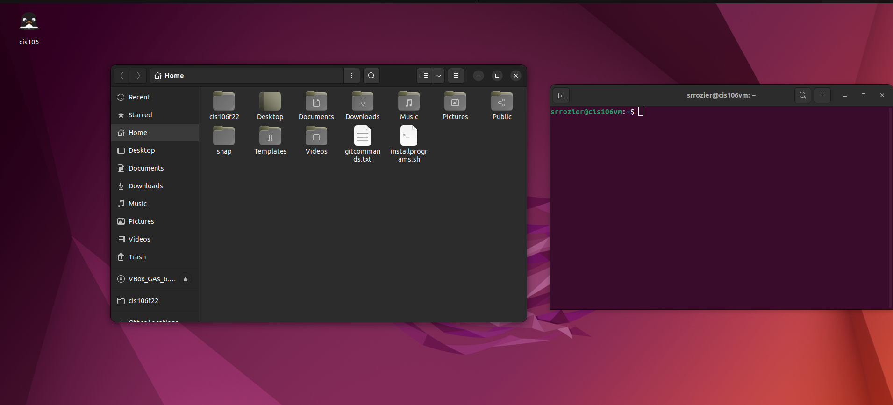

# Lab 3 Submission

## Question
Has no submission

## Question 2

## Question 3

| Program purpose     | Package Name     | Version                  |
| ------------------- | ---------------- | ------------------------ |
| Play a tetris game  | blockattack      | 2.7.0-1 amd64            |
| Play a video file   | dragonplayer     | 4:21.12.3-0ubuntu1 amd64 |
| Browse the internet | epiphany-browser | 42.4-0ubuntu1 amd64      |
| Read your email     | geary            | 40.0-2 amd64             |
| Play music          | gmpc             | 11.8.16-19 amd64         |

1. Which command did you use to install?
   sudo apt install 'package name here'
2. Which command did you use to remove?
   sudo apt remove 'package name here'
3. Which command did you use to install and remove?
    sudo apt install/remove 'package name here'

## Question 4

| command | what it does                                                   |
| ------- | -------------------------------------------------------------- |
| echo    | display a line of text                                         |
| fortune | print a random, hopefully interesting, adage                   |
| cowsay  | configurable speaking/thinking cow                             |
| lolcat  | rainbow coloring effect for text console display               |
| figlet  | display large characters made up of ordinary screen characters |
| toilet  | display large colourful characters                             |
| rig     | Random Identity Generator                                      |

