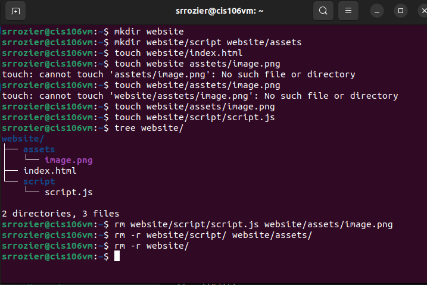
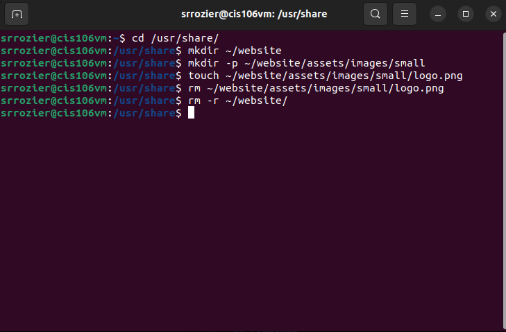
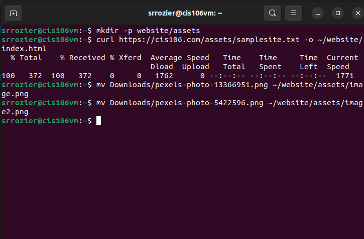
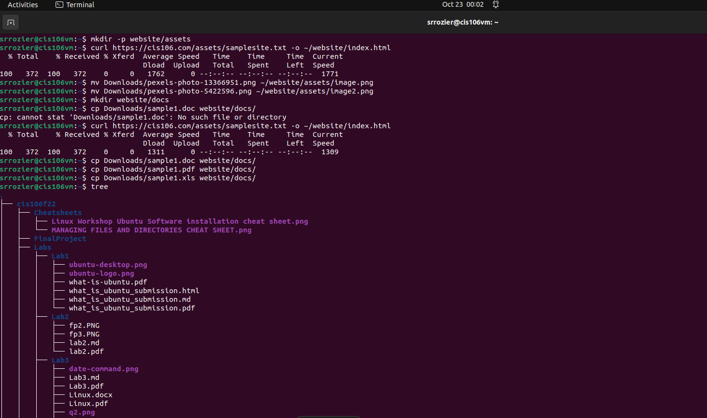

# Week Report 5
## What are Command Options?
The different ways a command can operate
## What are Command Arguments?
Arguments are the line of code the command is affecting
## Which command is used for creating directories? Provide at least 3 examples.
`mkdir`
### Examples
    * Create a directory in the present working directory
    *  `mkdir wallpapers`
    *  `mkdir wallpapers/ocean`
    *  `mkdir ~/wallpapers/forrest`
## What does the touch command do? Provide at least 3 examples.
It makes a file
    *  `touch waffles`
    *  `mkdir /home/srrozier/Desktop/food/waffles`
    *  `mkdir ~/food/waffles`
## How do you remove a file? Provide an example.
rm
`rm ~/food/waffles`
## How do you remove a directory and can you remove non-empty directories in Linux? Provide an example
You can only do so by using rmdir -r
`rmdir ~/food/
## Explain the mv and cp command. Provide at least 2 examples of each
mv -renames a file/moves it to a different directory
    * `mv ~/food/waffles ~/breakfast/`
    * `mv ~/food/waffles ~/breakfast/pancakes`
mv -copies a file to a specific directory 
    * `cp ~/food/waffles ~/food/`
    * `cp ~/food/waffles ~/breakfast/`

## Practice
* Practice 1

* Practice 2

* Practice 3

* Practice 4

