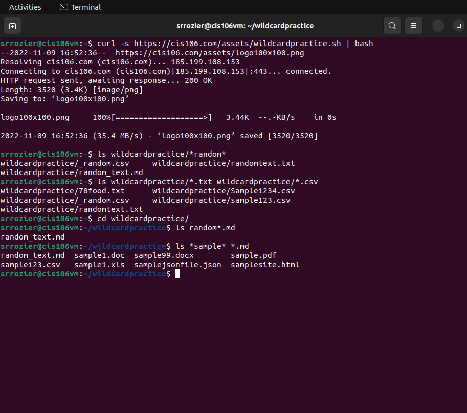
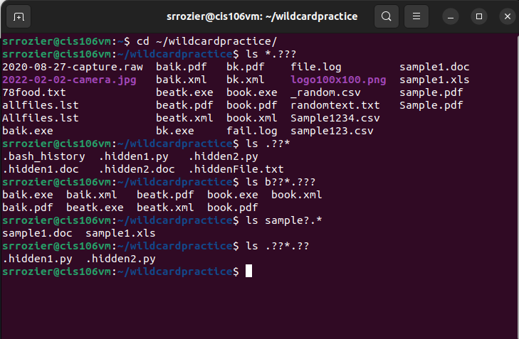
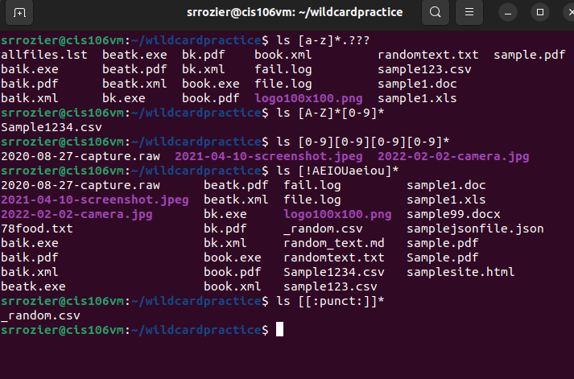

# Week Report  6

## Wildcards

### * Wildcard
The Star Wildcard matches from 0 to any number of Characters
* Examples
  * List all the text files in the directory
    * `ls *.txt`
  * List all the files that start with the word file
    * `1s file*`
  * Copy all the mp4 files
    * `cp Downloads/*.mp4 ~/Videos/Movies/`
### ? Wildcard
The ? wildcard matches a single character
* Examples
  * List all the files that have 3 characters and are followed by the word file in the name
    * `ls *???File*`
  * List all the hidden files in the current directory
    * `1s ./.??*`
  * List all the files that have a three letter file extension
    * `ls *.???`
### [] Wildcard
The bracket wildcard matches one character in a range
* Examples
  * List all the files that have a vowel after the letter f
    * `ls f[aeiou]*`
  * List all the files that don't have a vowel after the letter f
    * `ls f[!aeiou]*`
  * ist all the files that have an interger after the letter f
    * `ls f[0-9]*`
### Brace Expansion
Allows you to generate arbitrary strings to use with command
* Examples
  * Create a directory structure in a single command
    * `mkdir -p Music/{Jazz/Rock}/`
  * Create a number of files
    * `touch website{1..5}.html`
  * Remove multiple files in a single directory
    * `rm -r {dir1,dir2,dir3,file.txt}`
## Practice

### * Practice

### ? Practice

### [] Practice

